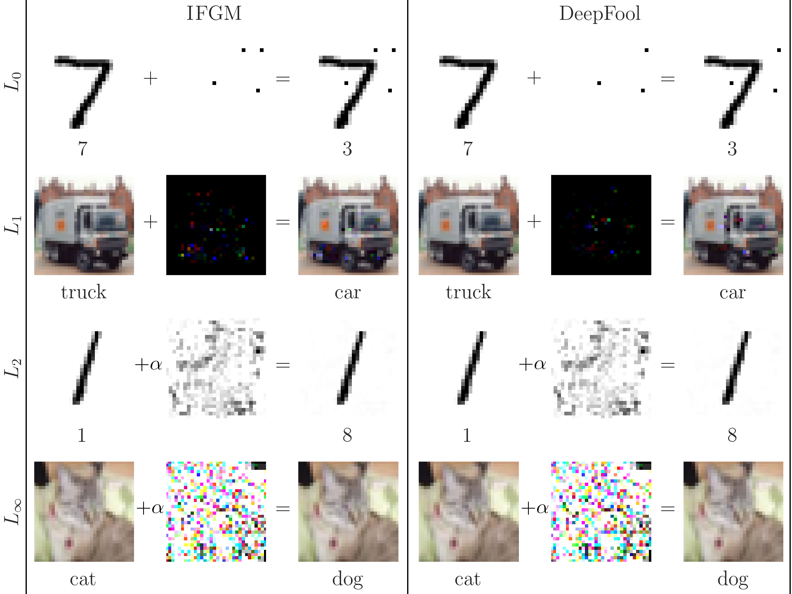
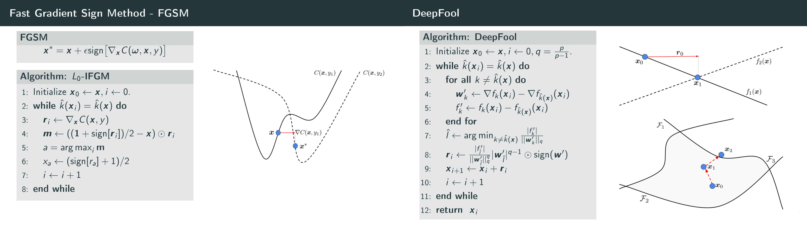

# Iterative, Gradient-Based Adversarial Attacks on Neural Network Image Classifiers

The main goal of the thesis is to investigate the properties of two adversarial attacks and extend them. 

The attacks are based on the papers:

- <u>Fast Gradient Sign Method (FGSM)</u>:  
  I.  Goodfellow,  J.  Shlens,  and  C.  Szegedy,  “Explaining and harnessing adversarial examples” in *International Conference on Learning Representations (ICLR)*, May 2015.
- <u>DeepFool</u>:
  S. Moosavi-Dezfooli,  A.  Fawzi,  and  P.  Frossard,  “Deepfool: A simple and accurate method to fool deep neural networks,” in *2016  IEEE Conference on Computer Vision and Pattern Recognition (CVPR)*, June 2016.

The following are eight examples of adversarial samples computed using the code in this repository. For each image, the initial image is shown with the label given to it by the network. The perturbation is shown as an *L*&#8734; normalized image and lastly the adversarial image is shown with the new label given to it by the network.

## Addition to original methods

In the code, several extensions to the original methods are implemented, both from literature and some original. FGSM is converted to an iterative method - IFGM. Both methods are implemented in all distance metrics: *L*0, *L*1, *L*2, *L*&#8734;. Lastly, both methods are implemented as targeted attacks. More specifically:

- <u>Iterative Fast Gradient Method (IFGM)</u>:  
  - IFGM is an iterative implementation of FGSM. It is similar to the BIM method used in *Adversarial examples in the physical world* [2017] I. Goodfellow et al.
  - Implemented with clipping. Clipping clips each pixel to values in [0,1] after each iteration to assure that the final image will have legal pixel values. This is also done in the BIM-paper.
  - Implemented as a fast *L*0 method, by changing the pixels with the largest *impact*, that is, the gradient times how much it can be changed. 
  - Targeted version, same idea as in BIM-paper.
- <u>DeepFool</u>:  
  - Implemented with clipping. Clipping clips each pixel to values in [0,1] after each iteration to assure that the final image will have legal pixel values. This is not done in the orginal paper, and our experiments show that is of great importance.
  - The clipping implementation, together with not changing extremal pixels,  lets us extend DeepFool to the *L*1 metric, previously believed to not work, as reported in *SparseFool: a few pixels make a big difference* [2019] A. Modas et al.
  - Implemented as a fast *L*0 method, with the same idea as IFGM.
  - Targeted version.

## Algorithms and schematics of attacks

## Description of files

- `Iterative_Gradient_Based_Adversarial_Attacks_on_Neural_Network_Image_Classifiers.pdf`
  - The final version of the report, 2019.
- `fgm_attack.py`
  - This program contains the FGM_attack module which creates an instance that finds adversarial examples derived from the FGSM method implemented in different norms.
- `deepfool_attack.py`
  - This program contains the DeepFool_attack module which creates an instance that finds adversarial examples derived from the DeepFool method implemented in different norms. 
- `examples.py`
  - This program uses the `fgm_attack` and `deepfool_attack` modules to create `examples.png`; four adversarial samples for each method in the four distance metrics: *L*0, *L*1, *L*2, *L*&#8734;.
-  `examples.png`
   - Examples images visible in the top of this `README.md`.
- `algorithms.png`
  - Illustrative image of a subset of the algorithms.
- Folder: `models`
  - Contains four neural network image classifiers trained on the MNIST and CIFAR-10 datasets. Two are deep neural networks (DNN) and two are convolutional neural networks (CNN) that the attacks are performed on. The networks are trained in a separate repository and only the architecture, weights and biases are available in this repository as .h5 files loadable by the Keras subroutine.